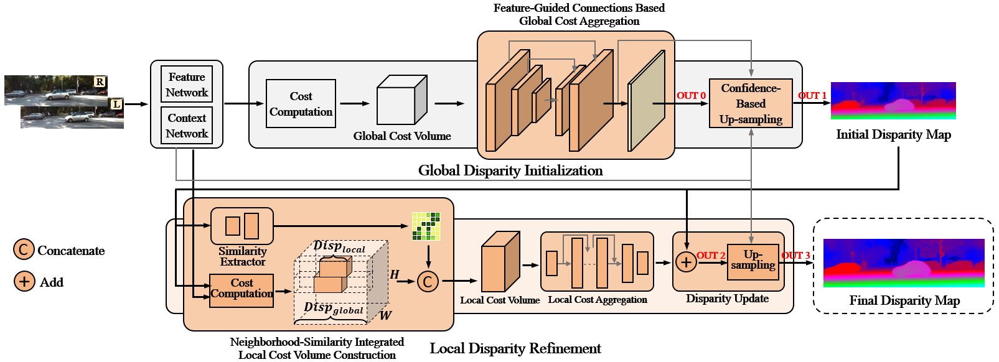
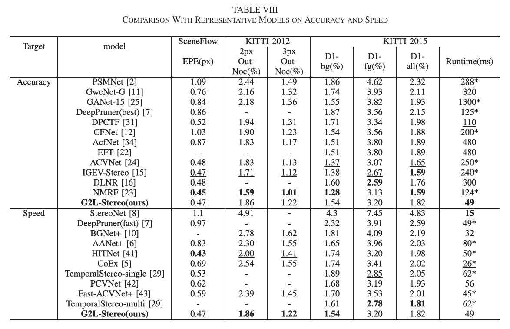
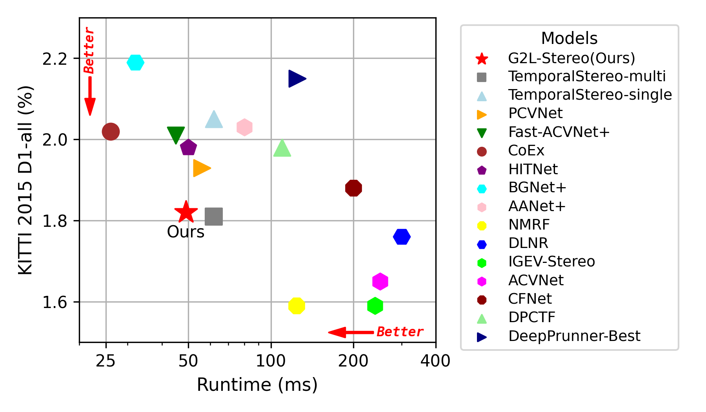
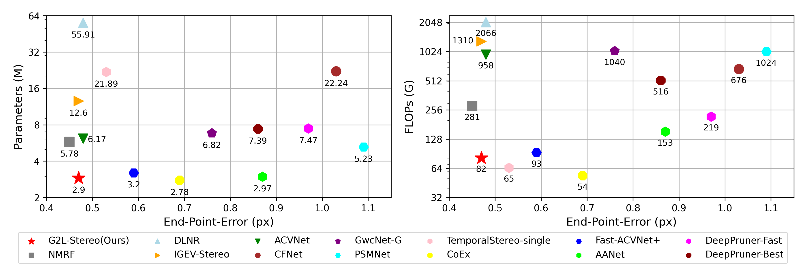

# G2L-Stereo: Global to Local Two-Stage Real-Time Stereo Matching Network

## Model


## Performance
[Leaderboard Link](http://www.cvlibs.net/datasets/kitti/eval_scene_flow.php?benchmark=stereo)





## Environment
* Python 3.8
* Pytorch 2.1.0

create a virtual environment and activate it.

```
conda create -n g2l python=3.8
conda activate g2l
```
install the follow dependencies 

```
conda install pytorch==2.1.0 torchvision==0.16.0 torchaudio==2.1.0 pytorch-cuda=11.8 -c pytorch -c nvidia -y
conda install ruamel.yaml -y
pip install opencv-python
pip install scikit-image
pip install tensorboard==2.12.0
pip install tensorboardX
pip install matplotlib 
pip install tqdm
pip install timm==0.6.5
```

## Data Preparation
Download [Scene Flow Datasets](https://lmb.informatik.uni-freiburg.de/resources/datasets/SceneFlowDatasets.en.html), [KITTI 2012](http://www.cvlibs.net/datasets/kitti/eval_stereo_flow.php?benchmark=stereo), [KITTI 2015](http://www.cvlibs.net/datasets/kitti/eval_scene_flow.php?benchmark=stereo)

In our setup, the dataset is organized as follows
```
SceneFlow
    ├── driving
    │   ├── disparity
    │   └── frames_finalpass
    ├── flyingthings3d_final
    │   ├── disparity
    │   └── frames_finalpass
    └── monkaa
        ├── disparity
        └── frames_finalpass

```

## Train
Use the following command to train G2L-Stereo on Scene Flow

Firstly, train the global disparity initialization network for 20 epochs,
```
python main_train.py\
    --dataset sceneflow\
    --datapath {{your sceneflow datapath}}\
    --trainlist ./filenames/sceneflow_train_2024-12-08.txt\
    --testlist ./filenames/sceneflow_test_2024-12-08.txt\
    --epochs 20 --lrepochs 14,18:3\
    --batch_size 8 --test_batch_size 4 --num_workers 8  --lr 0.001 --save_freq 1\
    --only_disp4
```
Secondly, freeze the global disparity initialization network parameters, train the remaining network for another 20 epochs,
```
python main_train.py\
    --dataset sceneflow\
    --datapath {{your sceneflow datapath}}\
    --trainlist ./filenames/sceneflow_train_2024-12-08.txt\
    --testlist ./filenames/sceneflow_test_2024-12-08.txt\
    --epochs 20 --lrepochs 14,18:3\
    --batch_size 8 --test_batch_size 4 --num_workers 8  --lr 0.001 --save_freq 1\
    --freezen_disp4 --loadckpt {{xxxx/checkpoint_000019.ckpt}}
```
Finally, train the complete network for 40 epochs,
```
python main_train.py\
    --dataset sceneflow\
    --datapath {{your sceneflow datapath}}\
    --trainlist ./filenames/sceneflow_train_2024-12-08.txt\
    --testlist ./filenames/sceneflow_test_2024-12-08.txt\
    --epochs 40 --lrepochs 20,30,35:3\
    --batch_size 8 --test_batch_size 4 --num_workers 8  --lr 0.001 --save_freq 1\
    --whole_with_ckpt --loadckpt {{xxxx/checkpoint_000019.ckpt}}
```


## Test 
you can test on the whole sceneflow dataset
```
python main_test.py\
    --dataset sceneflow\
    --datapath {{your sceneflow datapath}}\
    --testlist ./filenames/sceneflow_test_2024-12-08.txt\
    --test_batch_size 4 --num_workers 8\
    --logdir log_test --loadckpt pretrained_model/checkpoint_000039.ckpt
```


## Acknowledgements

Part of the code is adopted from previous works:[CoEx](https://github.com/antabangun/coex), [HITNet](https://github.com/MJITG/PyTorch-HITNet-Hierarchical-Iterative-Tile-Refinement-Network-for-Real-time-Stereo-Matching), [AcfNet](https://github.com/youmi-zym/AcfNet),[ACVNet](https://github.com/gangweiX/ACVNet)


